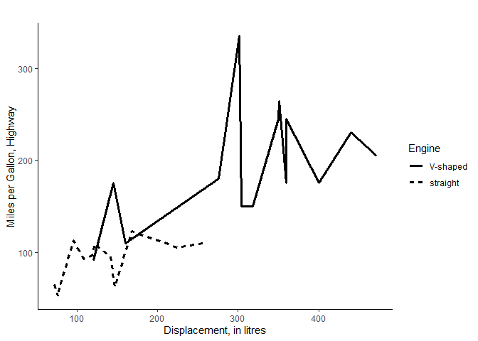
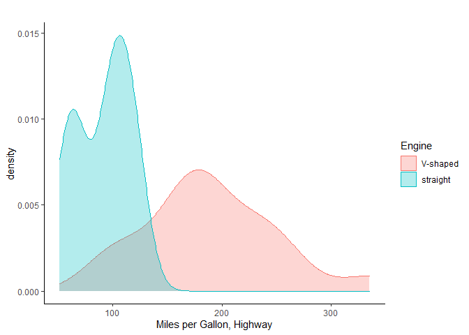

<!-- README.md is generated from README.Rmd. Please edit that file -->

# nicePlots

<!-- badges: start -->
<!-- badges: end -->

This package customizes ggplot2-plots for personal purposes. `nicePlots`
generates clean and simple plots with some support for customization.
Special attention has gone to provide intuitive support for grouping to
plot trends, histograms and densities for separate subgroups.

## Installation

You can install the development version of nicePlots from
[GitHub](https://github.com/) with:

``` r
# install.packages("devtools")
devtools::install_github("SZuzek/nicePlots")
```

## Example

A basic example how to plot visually appealing graphs with two groups.

``` r
library(nicePlots)
niceLinePlot(mtcars, "disp", "hp", linetype = "vs", linetypelabels = c("V-shaped", "straight"), linename = "Engine", line_size = 1.2, xlab = "Displacement, in litres", ylab = "Miles per Gallon, Highway")
```



`niceDensity` can be used to inspect distributions.

``` r
niceDensity(mtcars, "hp", color = "vs", fill = "vs", colorlabels = c("V-shaped", "straight"), colorname = "Engine", filllabels = c("V-shaped", "straight"), fillname = "Engine", xlab = "Miles per Gallon, Highway")
```


